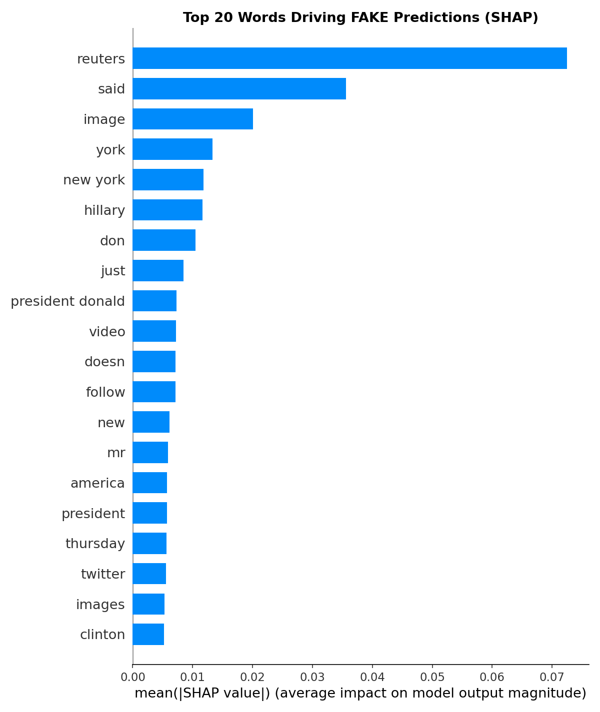
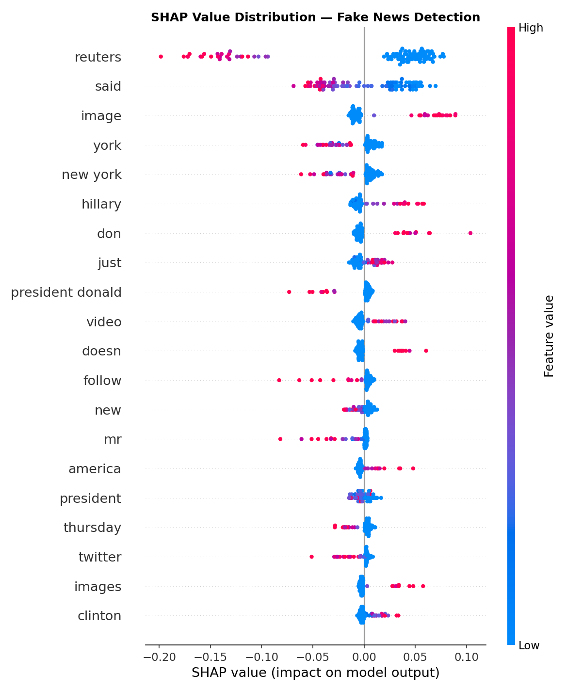
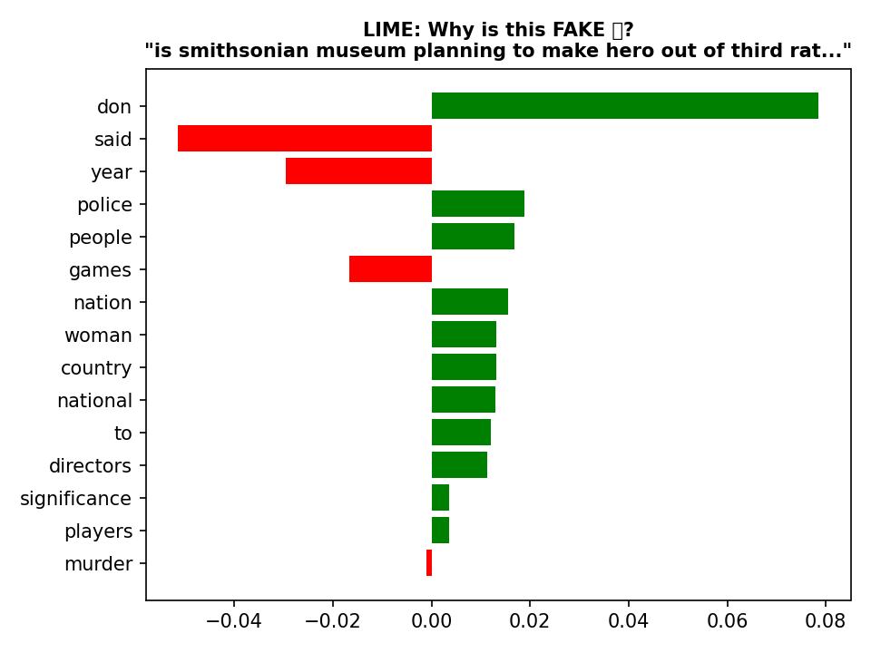

# 🧠 Fake News Detection with Explainable AI (XAI)

> Portfolio Project — Built for the Cognitive Technologies Research Group (CoRe) application.

---

## 📌 Project Overview

This project builds a **Fake News Classifier** trained on 72,134 real-world news articles. It combines Machine Learning with **Explainable AI (XAI)** techniques — making every prediction transparent and understandable to humans.

The project directly addresses CoRe's core research area:
> *"Human-centered and Explainable AI — developing algorithms that predict, classify, and explain their decisions to the user."*

---

## 🎯 Results

| Model | Accuracy | F1-Score (Fake) |
|---|---|---|
| Logistic Regression | 95% | 0.95 |
| Naive Bayes | 85% | 0.86 |
| **Random Forest** | **96%** | **0.96** ✅ |

**Best Model: Random Forest — 96% Accuracy**

---

## 🔍 Explainability

### SHAP — Global Explanation
Which words matter most across ALL 18,034 test articles?



### SHAP — Value Distribution
How does each word's impact vary across articles?



### LIME — Local Explanation
Why was THIS specific article classified as fake?



---

## 📁 Project Structure
fake-news-detection/
├── fake_news_detection.ipynb   ← full notebook
├── requirements.txt            ← dependencies
└── outputs/
├── fake_news_detector.joblib  ← saved model
├── shap_global_bar.png        ← SHAP chart
├── shap_beeswarm.png          ← SHAP chart
└── lime_explanation.png       ← LIME chart

---

## 🚀 How to Run

### 1. Clone the repository
```bash
git clone https://github.com/YOUR_USERNAME/fake-news-detection.git
cd fake-news-detection
```

### 2. Install dependencies
```bash
pip install -r requirements.txt
```

### 3. Get the dataset
Download WELFake dataset from Kaggle:
https://www.kaggle.com/datasets/saurabhshahane/fake-news-classification

Place it in:
data/WELFake_Dataset.csv

### 4. Run the notebook
Open `fake_news_detection.ipynb` in Jupyter or Google Colab.

---

## 🛠️ Tech Stack

| Tool | Purpose |
|---|---|
| pandas | Data loading and manipulation |
| scikit-learn | TF-IDF, models, evaluation |
| SHAP | Global explainability |
| LIME | Local explainability |
| matplotlib | Visualizations |
| joblib | Model saving |

---

## 📊 What I Learned

- How to build an end-to-end ML pipeline
- Text preprocessing and TF-IDF vectorization
- Training and comparing multiple classifiers
- Evaluating models with precision, recall, F1
- Explaining black-box models with SHAP and LIME

---
Limitaions
Model performs poorly on short texts and out-of-domain content.
Trained exclusively on US political news 2015-2018


